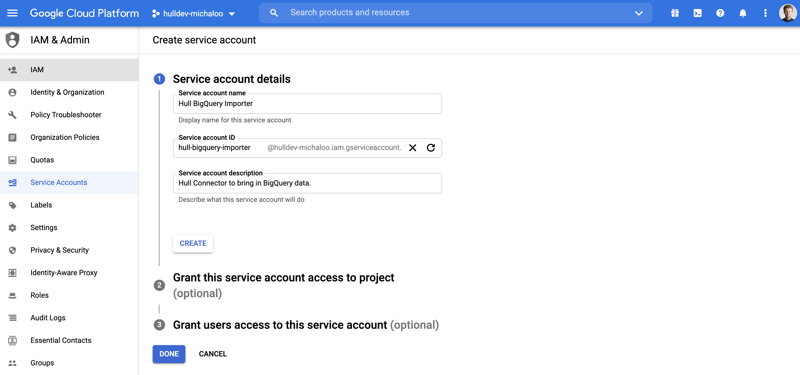
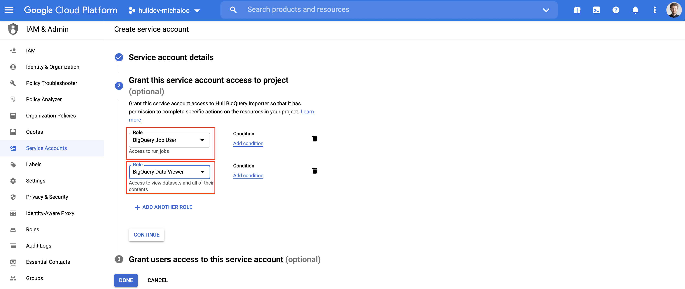
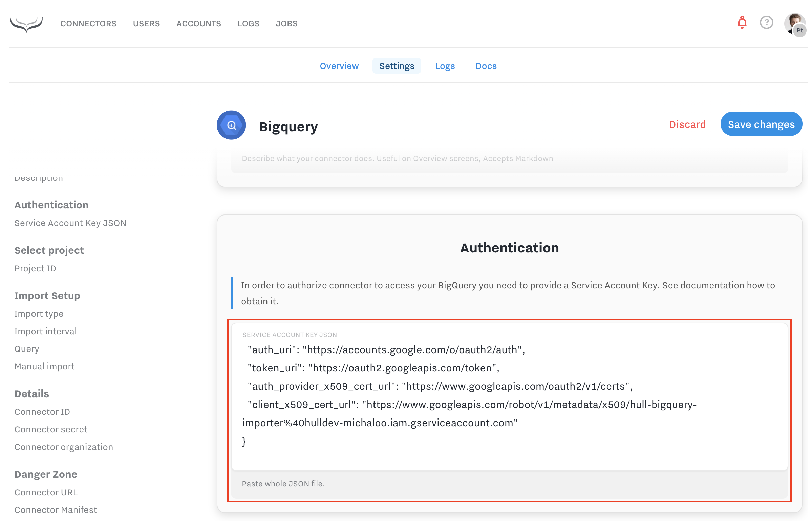

# BigQuery Importer

BigQuery importer allows you to setup an automatic data import based on any BigQuery query. That way you can fetch Users, Accounts, and User Events based on a selected interval.

## Installation

Pick the connector from the connectors gallery. One connector can run one query only so you may need to install multiple connectors.

## Getting started

### Authorization & Setup

After installing the connector from the gallery, you need to authorize it against BigQuery API using Service Accounts.

This requires provisioning a Service Account in your Google Cloud project. This is a one time operation and gives you precise control over what connector can access in your BigQuery data base.

1. First, in Google Console navigate to `IAM & Admin > Service Accounts` with this [link](https://console.cloud.google.com/iam-admin/serviceaccounts), select your project and click `CREATE SERVICE ACCOUNT` at the top. This will show you a form to fill in details about a new service account. Pick a meaningful name and description here:
  
2. Click `CREATE` and assign this Service Account a `BigQuery Job User` and `BigQuery Data Viewer`. This can be adjusted later and any custom IAM role can be applied, but the connector needs access to the data you want to query (`bigquery.tables.getData` permission) and the two following BigQuery permissions:
  - `bigquery.jobs.create`
  - `bigquery.jobs.get`
  Contact your Google Cloud Admin in case of concerns or questions.
  
3. You will be redirected to the list of Service Accounts, find the one you just created and click "Create Key":
  
4. In the new modal keep the JSON format option, the other one is not supported:
  
5. A new JSON file will be downloaded by your browser. This is the only copy of the key and cannot be restored. Open it in a basic text editor such as TextEdit on Mac and **copy the whole content** of the file:
  
6. Paste it in the Authentication section of your BigQuery connector settings:
  
7. Save the settings before going forward.

Once this is done you need to define which BigQuery project the connector should work in. This is a single select dropdown.

The final part of the setup is to define what kind of Hull Entity connector should import. You can select users, accounts, and events. Additionally below you can define on which schedule the importer will run the query.

Now it's time to write the query.

### Writing the query

Once the connector is set up, you can navigate to the query editor in the overview screen of the connector.

You can write and verify the query which is the core part of the import process. The connector will run your query on a defined schedule and every result row will be imported as a Hull User, Account, or User Event. The import row can create or update those entities.

The query result must include at least one column with an identifier. This column will be used to find existing Hull Users or Accounts. Data from every other column will be imported as attributes in a separate group.

Feel free to write the query either in the connector editor or in the BigQuery console. Once you are satisfied with your query you can preview it in the query editor which will show you how data will be imported and if all required identifiers are present.

## Saving query and running import

If the results are correct you can now save the query.
From that moment the connector will run it based on the scheduled interval you defined in the settings.

Optionally you can run the import manually right after saving the query. Hit the import button to start it.

Every import will run in the background and you can use connector logs to see the progress of incoming data.
