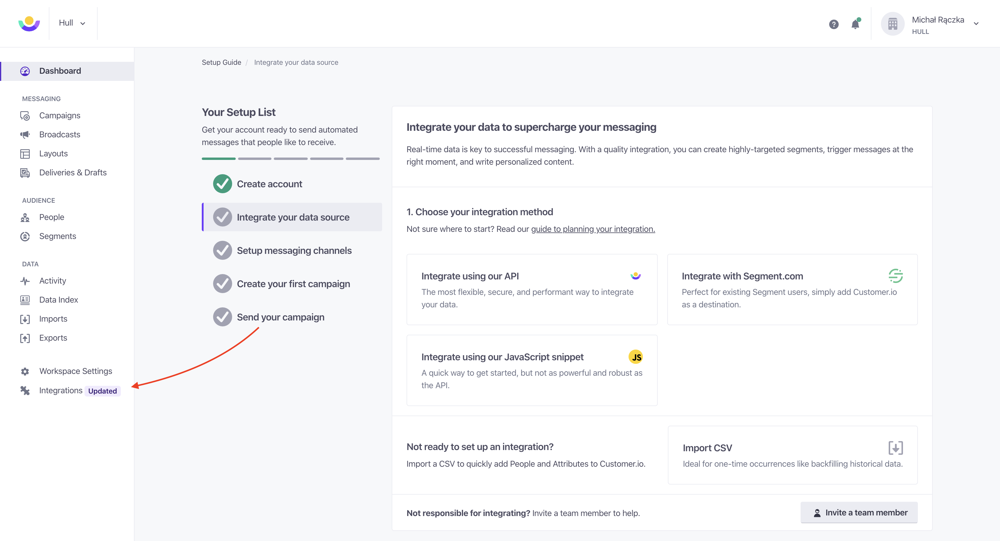
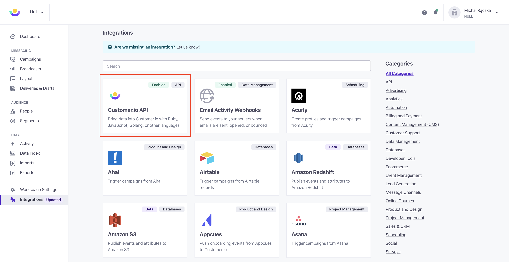
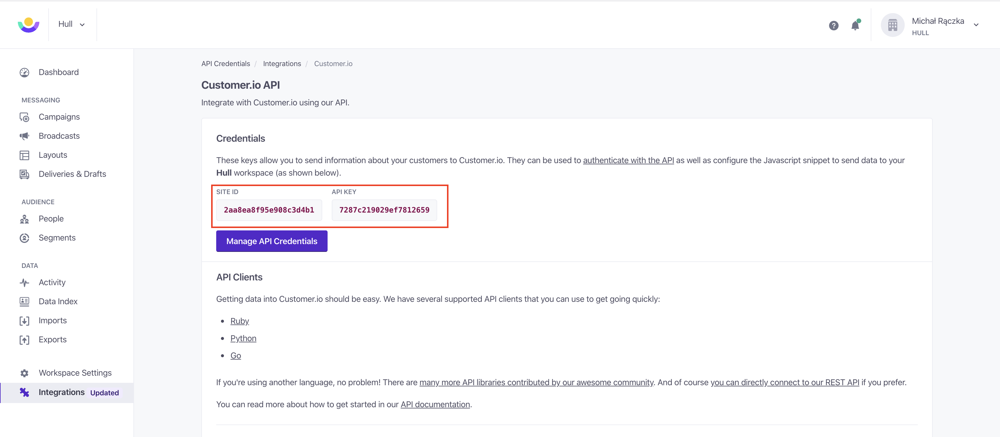
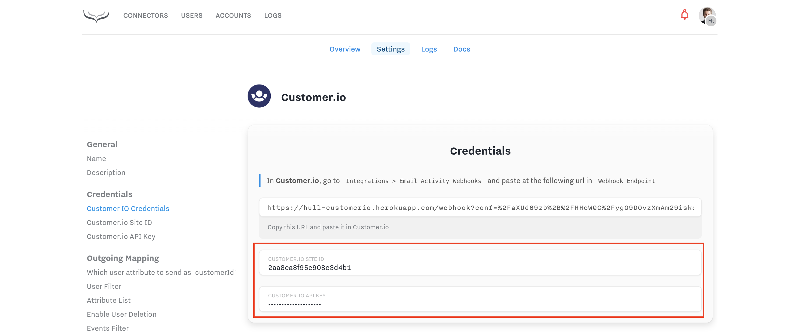
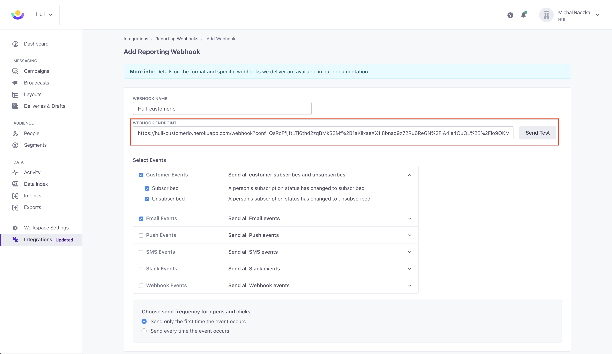
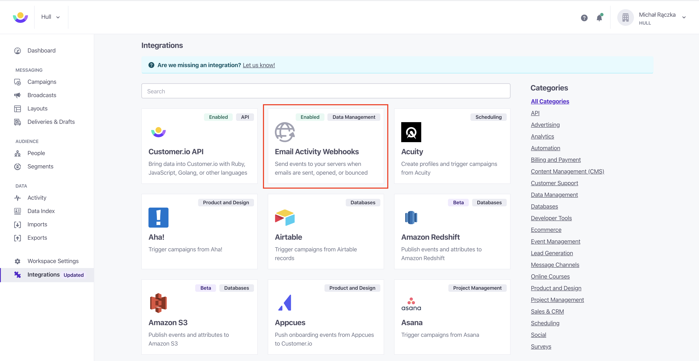

# Customer.io Connector

The Customer.io Connector enables your team to synchronize users from Hull with Customer.io to automate customer lifecycle emails and campaigns. It also allows to get back email activity events back to Hull.

## Features

The customer.io connector allows you to synchronize users from Hull with persons in customer.io to automate customer lifecycle emails and campaigns. You can also forward events/activities from Hull to customer.io to use this behavior data to trigger powerful workflows to send emails, SMS and more.

You can also feed events related to email activity back from customer.io into Hull to leverage this information in your other connected tools.

The Customer.io Connector supports to `update traits` and `create events`.

## Getting Started

### Authorize outgoing traffic

1. In **Customer.io** head to **Integrations** and select **Customer.io API** section. At the top of the screen you will find `SITE ID` and `API KEY`.

  

  

  

2. In **Hull**, open the **Settings** tab of your Customer.io connector, scroll down to the **Credentials** section and fill in the `SITE ID` and `API KEY`.

  

That's it! The connector is now ready to send data to Customer.io!

### Receiving Email activity from Customer.io

To receive customer activity from Customer.io you need to tell Customer.io to send events to Hull when something happens.

1. Start by opening the `Settings` tab in Hull, and copying the generated Webhook URL:
  
2. Then go to **Customer.io**.
3. Click on "Integrations".
4. Find and click on "Email Activity Webhooks".
5. Paste the URL you copied in the box. Check all event types below it.
6. Click on the button “Send Test” and save your changes if the symbol indicates success.
  

That's it! The connector is now ready to receive data to Customer.io!

## Configuration

When connector is authorized against Customer.io API, it's time to define what data exactly will be send and received from Customer.io.

### Sending Users

Start with Outgoing Mapping section in the settings.

The most important decision you have to make here is **which user attribute to send as the** `**customerId**` to customer.io which is the unique identifier within customer.io. Our recommendation is to either use the `external_id` if you assign your own identifier to users in Hull or use the Hull `id`.

In order to send out some users, you need to determine the **whitelisted segments** which a user needs to belong to in order to send it to Customer.io. If you don’t specify any segments, no user will be send to Customer.io.

Next step of the setup is to specify the attributes to send from Hull to Customer.io. In addition to any attributes you select here we always send out `email`, `customerId` and an attribute called `hull_segments` that contains the names of all the segments the User belongs to.

> **IMPORTANT**: Please keep in mind that Customer.io API allows to send maximum 30 attributes per API call so bigger number of selected attributes will double the number of API calls and can make the connector slower.

You can also determine how to handle when a user leaves a segment. When you **enable user deletion**, the connector will automatically remove users from Customer.io if they no longer belong to any of the whitelisted segments. Otherwise if a user leaves all whitelisted segment it will be kept in Customer.io without any further updated.

Furthermore, you can specify which **events** shall be send to customer.io by selecting the events from the dropdown list. By default no events are sent.
Each outgoing event will create a new activity in Customer.io, the type will be set to Event and Activity Name will have the same name as Hull Event, which allows basic segmentation in Customer.io. Page view events are working differently, see details below.

### Sending Page View Events

Customer.io allows to handle Page Views differently than generic events. As soon as you whitelist `page` event in the connector settings the connector will start to send them and create new Activities in Customer.io, but this time the Type of Activity will be set to Page View and the name of the activity will be the url of the Page View. This is aligned with Customer.io [documentation on tracking page views](https://customer.io/docs/pageviews) and allows to build more fine grained segments in Customer.io.
The url of the Page View activity will be picked from Hull Event url property, if not found it will fall back to page_url context property. Additionally a referrer will be added to the Customer.io will be added.

### Sending Anonymous Events

You can also activate **Anonymous Events**, which is an advanced feature in Customer.io. If you are not familiar with this feature, you can read more in Customer.io’s own [documentation](https://customer.io/docs/anonymous-invite-emails).

## Optional - receiving subset of Customer.io events

Optionally, You can choose to limit the events Hull will receive from Customer.io. The list of all events is available in the Customer.io docs under [https://customer.io/docs/webhooks#events](https://customer.io/docs/webhooks#events).

To customize this list, navigate to your Customer.io dashboard, select **Integrations** from the menu to the left side of your screen and click **Email Activity Webhook** card:

On the next page, you can select the events you want to receive from the list and save your changes:

