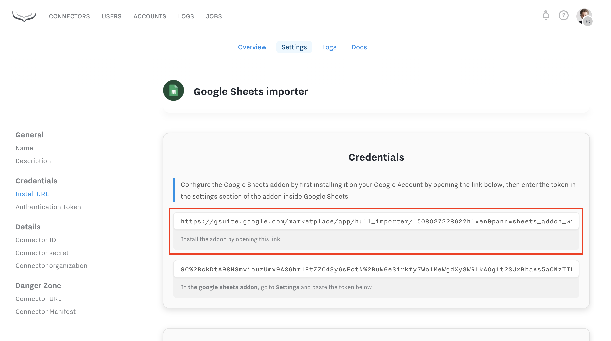
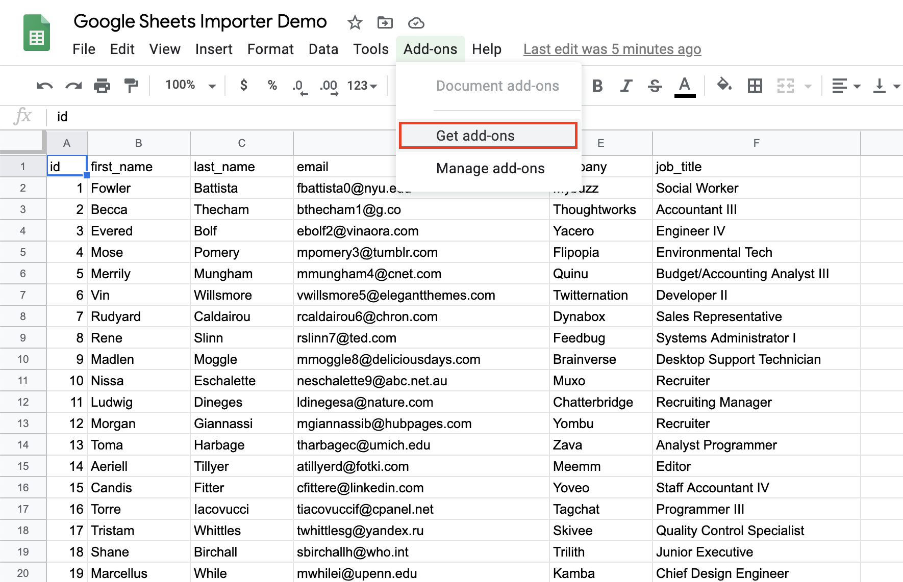

# Google Sheets Importer

Google Sheets Importer enables you to perform manual data imports directly from any Google Spreadsheet. That way you can fetch Users, Accounts and User Events coming from any source which can be imported to a sheet.

## Installation

After installing the connector from the gallery you need to install the Hull Add-on in the G-Suite Marketplace.

You can either follow a link exposed in connector settings here:

Or alternative search for it directly in G-Suite Marketplace:

Install the add-on and provide it with the necessary permissions in order to read content of your spreadsheet and send it to your Hull organization.

Once the add-on is installed it will be available in the Add-ons menu.

The next step is to connect the add-on with connector by copying and pasting an authorization token.
If you open the add-on you will see a sidebar appearing with a welcome screen, and a field within to save the token:

You can obtain the token from Connector settings page:

Once the token is saved you will see fields to setup and run your import. You are now ready to use the connector.

## Getting Started

To perform an import on a new or existing spreadsheet, at any time you can open the sidebar by going to Add-ons menu:

Sidebar configuration and import operation are always applied and running on the sheet you are displaying with the sidebar.

Please check our detailed Guides on how to import data in different scenarios:

[Getting Started: Sending data to Hull](https://www.hull.io/docs/guides/getting-started/)

## Settings Reference

### Import Type

Defines the entity type that will be created during the import based on row data.

In case of User Events import Users still can be created if they were not present in Hull before import. This is required in order to attach events to them correctly.

### Claims

Mapping for user or account identification claims. Defines columns where identifiers are present.
At least one mapping needs to be setup.
Rows without any valid identifier will be skipped.

In case of User Events, since they are attached to Users, this setting works exactly the same as for Users.

### Event Settings

Only available when Import Type is set to User Events.
This section allows to define how to map additional event related parameters:

- Event Name is a required mapping. Rows without this value will be skipped
- Event Date is optional and will be used as original event creation date on user timeline. Refer [platform documentation](https://www.hull.io/docs/data_lifecycle/ingest/#trait-types) for supported date formats
- Event ID is optional and can be used to prevent duplicating events

### Import Group

Only available when Import Type is set to Users or Accounts.
Define attributes group where all mapped attributes will be stored within.
It can be left blank in order to import top-level attributes.

### Columns Mapping

Defines how to map sheet columns into attributes or event properties.
By default, attribute or property name is populated using the lower underscore case version of the column name. It can be changed to any name using Hull's naming conventions. When mapping dates or timestamps, you need to add `_at` or `_date` at the end of the attribute name.
Refer [platform documentation](https://www.hull.io/docs/data_lifecycle/ingest/#trait-types) for details and forbidden names.

Non mapped columns are ignored.

## Import operation

When import setup is valid and complete, an import button at the top becomes active.
If it's inactive, there may be unresolved configuration you need to take care of before importing.

Before triggering the import some rows needs to be selected in order to be imported. It does not matter which columns are selected. All configured mappings are applied to whole rows.

Text on the button reflects the selection of rows and gives a hint of which rows will be imported.

Once the button is hit, the import operation starts and a confirmation message will appear below that button.

## FAQ

### Number of imported users is smaller than number of selected rows, why?

This may be caused by the fact that some of the selected rows don't contain
any identifier. In such case whole row is ignored since non-identifiable entities are not allowed in Hull.
Screenshot below illustrate this behavior - 3 rows are selected, but two of them have empty cells mapped to identity claims.
As a result just 1 row is processed.

### How to switch organization Hull Importer Add-on is sending data to?

Being able to switch existing spreadsheet from one organization to another may be important
to perform an initial testing import in your staging organization, and then re-running the exact same setup in your production organization.
``
Assuming that you already have a spreadsheet where the Hull Importer Add-on is installed and configured, you just need
to click the "Edit settings" button at the top of the sidebar and paste the generated token by the connector you have installed in the desired organization.

Then hit "save", the connector will reload and work with new organization.

