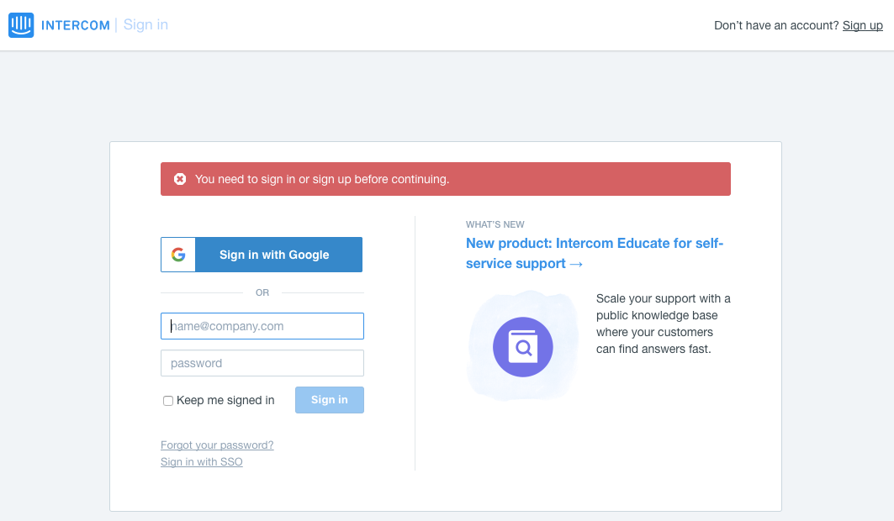
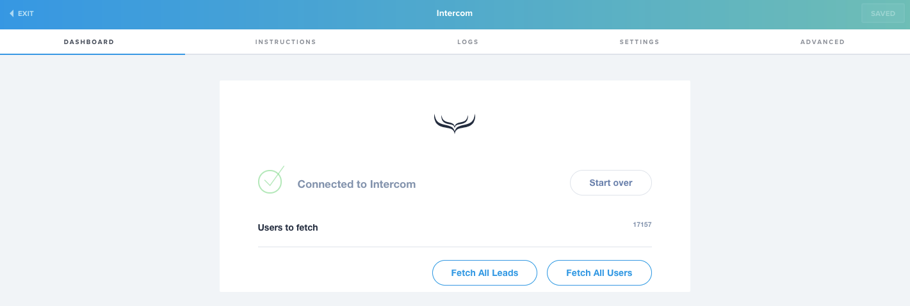
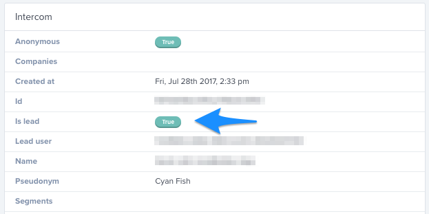
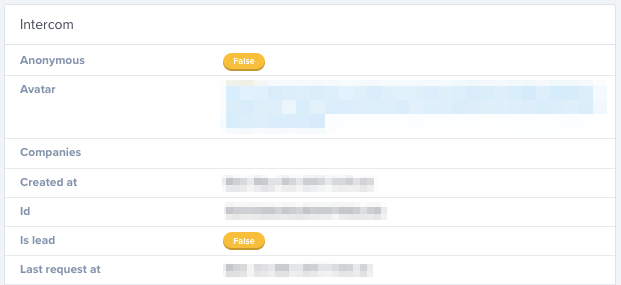

# Intercom Connector - Docs

The Intercom Connector enables your sales team to engage with leads and helps your support team to stay in touch with customers by integrating Intercom seamlessly with other data sources.

## Getting Started

Go to the Connectors page of your Hull organization, click the button “Add Connector” and click “Install” on the Intercom card. After installation, start at the “Dashboard” tab by authenticating with Intercom:

After clicking on the button “Continue with Intercom”, you will be redirected to the login page of Intercom. Enter your credentials here or authenticate with Google to continue:

Upon successful authentication you will be redirected back to Hull:

Before you fetch leads or users from Intercom, you need to complete your setup on the “Settings” and customize how Hull integrates with Intercom:

- [Specify the Users who are getting synchronized](#Specify-the-Users-who-are-getting-synchronized)
- [Define whether and which Events are sent to Intercom](#Define-whether-and-which-Events-are-sent-to-Intercom)
- [Determine the attributes Hull sends to Intercom](#Determine-the-attributes-Hull-sends-to-Intercom)
- [Specify custom attributes to fetch from Intercom](#Specify-custom-attributes-to-fetch-from-Intercom)

## Features

The Hull Intercom Connector allows your organization to synchronize leads and users from and to our platform. Once you have your data in Hull, you can send it to other tools to keep your entire stack in sync or update Intercom with data from other sources.
If you want to reveal anonymous traffic, you can combine the Intercom lead data with tracking data from your website and Clearbit data.
You can leverage Hull’s powerful segmentation engine together with Intercom to automate tagging of leads and users. By using action-driven segments in Hull you can create dynamic lists in Intercom to automate your messaging based on touchpoint activities. The Connector automatically creates the segment tags for you which you can combine with your own custom tags in Intercom. Hull provides you the flexibility to communicate with your customers in a flexible and automated way.
Conversations in Intercom are synchronized near-real time with the Event stream of the Hull user profile which enables you to trigger further actions in other tools of your stack.

The Intercom connector supports to `create users`, `add traits` and `update traits`.

## Specify the Users who are getting synchronized

The Intercom Connector fetches updates for all leads and users from Intercom automatically.
By default no users are sent from Hull to Intercom, you need to define explicitly the segments for which users are getting sent. Go to the “Settings” tab of the connector and locate the section “Connector Configuration”. Specify the segments in the following field:

## Define whether and which Events are sent to Intercom

Events are how user activity is stored in Intercom. The Intercom Connector allows your team to send any event from Hull to Intercom. You can configure which events are sent to Intercom in the section “Event Handling:

Events are used for filtering and messaging, and event names are used directly in Intercom, we recommend sending high-level activity about your users rather than raw streams of all events. The recommendation for event names is to combine a past tense verb and nouns.

Note: The Intercom Connector automatically handles events received from Intercom, for a detailed list of the events received, see [Deep-Dive: Received Notifications from Intercom (Topics)](#Deep-Dive%3A-Received-Notifications-from-Intercom-%28Topics%29).

## Determine the attributes Hull sends to Intercom

You can customize the attributes which are getting synchronized with Intercom in the section “Outgoing Attributes (Hull to Intercom)” of the “Settings” tab:

You have the option to determine which is the leading, either Hull or Intercom in case of conflicting data. If you make Hull the leading system, check the box “Hull overwrites Intercom”. In this case the value in Hull for a given attribute will always take precedence over the value in Intercom. For example, the attribute company does have the value “XYZ Inc.” in Hull and Intercom has “XYZ”, if you check the box, the value in Intercom will be updated with “XYZ Inc.”, otherwise “XYZ” will stay in Intercom.

Note: If you have changed your custom attributes in Intercom or set up the Connector for the first time, please refer to the section [Retrieve Intercom Attributes initially or Refresh Custom Attributes](#Retrieve-Intercom-Attributes-initially-or-Refresh-Custom-Attribute).

## Specify custom attributes to fetch from Intercom

Hull will always fetch all standard attributes for leads and users from Intercom and save them in the attribute group Intercom. If you do have custom attributes or want to map standard attributes to a specific attribute in Hull, you can define this behavior in the section “Incoming Attributes (Intercom to Hull)” within the “Settings” tab:

Note: If you have changed your custom attributes in Intercom or set up the Connector for the first time, please refer to the section [Retrieve Intercom Attributes initially or Refresh Custom Attributes](#Retrieve-Intercom-Attributes-initially-or-Refresh-Custom-Attribute).

## How to distinguish between leads and customers?

Intercom distinguishes leads and customers which are both users in Hull, but you can easily distinguish them by looking at the attribute `intercom/is_lead`. If this attribute is set to `true`, the user is a lead, otherwise a customer:

## How does the Connector handle if a Lead turns into a Customer?

If a Lead is converted in a Customer, Intercom sends this information to Hull in near-real time. As soon as the information is available, the attribute `intercom/is_lead` is set to `false` as shown below:

As soon as a lead turned into a customer, all further interaction between Hull and Intercom will be associated with the customer.

## Retrieve Intercom Attributes initially or Refresh Custom Attributes

When you initially configure the Intercom Connector, it does not have any information about the available Intercom attributes. You will see a spinning progress indicator that indicates this status:

If this is the case, please return to your Dashboard tab and click on either “fetch” button. This will force the Connector to retrieve metadata from Intercom. The attributes will become available near-real time, so you can continue with the configuration.

Note: Intercom does not provide an API endpoint to gather this information, that is why the Connector has to rely on the metadata from fetched customers and leads.

## How do I link anonymous traffic on my website and Intercom Leads in Hull

To link the anonymous traffic and the leads in Intercom, you need to be using [Hull.js](https://www.hull.io/docs/reference/hull_js/) to track data in your website (You do this by adding a `Platform` to Hull)
and then you need to enable the Intercom connector client-side component by adding it to the platform.

When you do this: 
- The Intercom Visitor IDs will be added to the current visitor list of aliases and this will link the Intercom Lead profile and the online visitor profile.
- Any `tracking` or `traits` call you make to Hull.js will also be sent to Intercom in parallel, This way you don't have to instrument your code twice.

This is an advanced topic and we suggest you reach out to us so we can help you set this up

## Deep-Dive: Received Notifications from Intercom (Topics)

The Connector subscribes to the following topics to receive near-real time notifications from Intercom. The following list provides an overview of the different types and clarifies how hull treats data in each case:

| **Topic**                         | **Description**                              | **Connector Action**                                                                                                  |
| --------------------------------- | -------------------------------------------- | --------------------------------------------------------------------------------------------------------------------- |
| conversation.user.created         | Customer or lead initiated message           | Create a new event “User started conversation”                                                                        |
| conversation.user.replied         | Customer or lead replies                     | Create a new event “User replied to conversation”                                                                     |
| conversation.admin.replied        | Admin conversation replies                   | Create a new event “Admin replied to conversation”                                                                    |
| conversation.admin.single.created | Admin initiated 1:1 conversation             | Create a new event “Admin started conversation”                                                                       |
| conversation.admin.assigned       | Admin conversation assignments               | Create a new event “Admin assigned conversation”                                                                      |
| conversation.admin.opened         | Admin opens conversation                     | Create new event “Admin opened conversation”                                                                          |
| conversation.admin.closed         | Admin closes conversation                    | Create a new event “Admin closed conversation”                                                                        |
| user.created                      | Customer creations                           | Create a new user in Hull or update an existing one.                                                                  |
| user.deleted*                     | Customer deletions. Not for bulk operations. | Update user in Hull.                                                                                                  |
| user.tag.created                  | User being tagged.                           | If the tag does not match a segment in Hull a new event “Added Tag” is created.                                       |
| user.tag.deleted                  | User being untagged. Not for bulk deletions. | If the tag does not match a segment in Hull a new event “Removed Tag” is created.                                     |
| user.email.updated                | Customer’s email address being updated.      | Update user in Hull.                                                                                                  |
| contact.created                   | Lead creations                               | Create a new user in Hull or update an existing one.                                                                  |
| contact.signed_up                 | Lead converting to a Customer                | Update user in Hull and set trait `intercom.is_lead` to `false`.                                                      |

\* User Deletion Caveats:
- A `user.deleted` webhook is only triggered when a single user or lead is archived.

- A `user.deleted` webhook is NOT triggered when multiple users or leads are archived in bulk. 

- A `user.deleted` webhook is NOT triggered when the user or lead is permanently deleted. 
